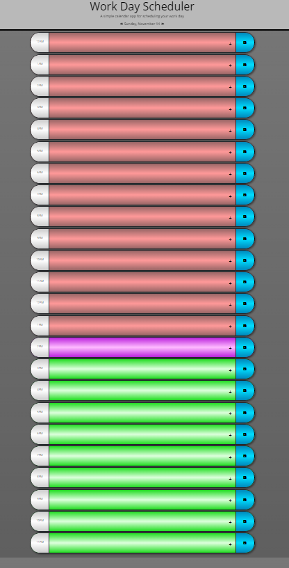

Code: https://github.com/CyanideTheJuggla/work-day-scheduler/<br/>
Deployment: https://cyanidethejuggla.github.io/work-day-scheduler/<br/>
Screenshot: <br/> 

# 05 Third-Party APIs: Work Day Scheduler

Create a simple calendar application that allows the user to save events for each hour of the day. This app will run in the browser and feature dynamically updated HTML and CSS powered by jQuery.

The starter code uses the [Moment.js](https://momentjs.com/) library to work with date and time, but you're free to use a different JavaScript solution to handle this functionality because Moment.js is considered a "legacy" product. Learn more about these other solutions in the [Moment.js project status page.](https://momentjs.com/docs/#/-project-status/).

## User Story

```
AS AN employee with a busy schedule
I WANT to add important events to a daily planner
SO THAT I can manage my time effectively
```

## Acceptance Criteria

```
GIVEN I am using a daily planner to create a schedule
WHEN I open the planner
THEN the current day is displayed at the top of the calendar
WHEN I scroll down
THEN I am presented with timeblocks for standard business hours
WHEN I view the timeblocks for that day
THEN each timeblock is color coded to indicate whether it is in the past, present, or future
WHEN I click into a timeblock
THEN I can enter an event
WHEN I click the save button for that timeblock
THEN the text for that event is saved in local storage
WHEN I refresh the page
THEN the saved events persist
```

## Review

You are required to submit the following for review:

- The URL of the deployed application.

- The URL of the GitHub repository. Give the repository a unique name and include a README describing the project.

## Grading Requirements

This challenge is graded based on the following criteria:

## Technical Acceptance Criteria: 40%

Satisfies all of the above acceptance criteria plus the following:

- [x] Uses the ~~Moment.js~~ `Luxon` library to work with date and time

## Deployment: 32%

- [x] Application deployed at live URL
- [x] Application loads with no errors
- [x] Application GitHub URL submitted
- [x] GitHub repo contains application code

## Application Quality: 15%

- [x] Application user experience is intuitive and easy to navigate
- [x] Application user interface style is clean and polished
- [x] Application resembles the mock-up functionality provided in the Challenge instructions

## Repository Quality: 13%

- [x] Repository has a "unique" name
- [x] Repository follows best practices for file structure and naming conventions
- [x] Repository follows best practices for class/id naming conventions, indentation, quality comments, etc.
- [x] Repository contains multiple descriptive commit messages
- [x] Repository contains quality README file with description, screenshot, and link to deployed application

---

© 2021 Trilogy Education Services, LLC, a 2U, Inc. brand. Confidential and Proprietary. All Rights Reserved.
